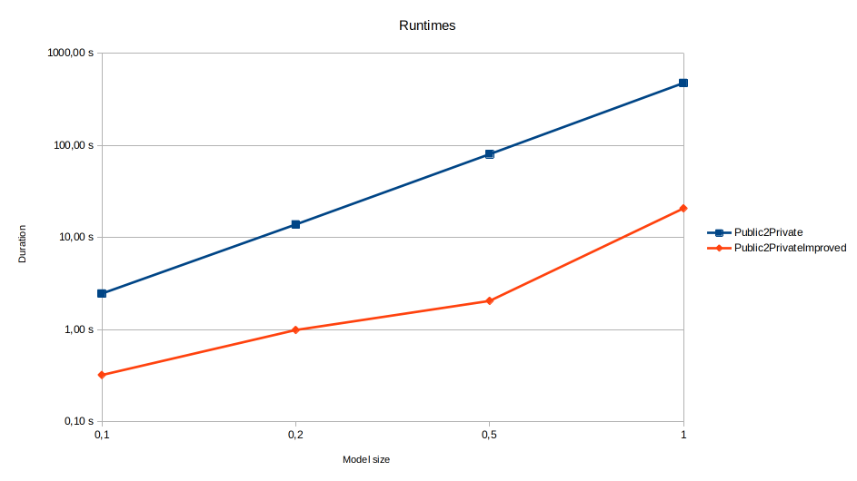

# JavaPublic2Private
This example Eclipse project runs the "Public 2 Private" case study from [LinTra](https://atenea.lcc.uma.es/projects/LinTra.html). It includes the original transformation code, as well as an improved version. Note that the improved version of the transformation must be compiled with [ATL/EMFTVM](https://wiki.eclipse.org/ATL/EMFTVM) 4.8.0 or higher to benefit from the [search plan generation](https://bugs.eclipse.org/bugs/show_bug.cgi?id=581655).

## Runtimes

| Model            | Size | Public2Private | Public2PrivateImproved |
|------------------|------|----------------|------------------------|
| eclipseModel-0.1 | 0,1  | 2,46 s         | 0,32 s                 |
| eclipseModel-0.2 | 0,2  | 13,86 s        | 0,99 s                 |
| eclipseModel-0.5 | 0,5  | 80,37 s        | 2,05 s                 |
| eclipseModel-1.0 | 1    | 475,73 s       | 20,74 s                |



## Original version

Run against eclipseModel-0.1.xml:

```
Profiling results:
	Duration (sec.)	Duration (%)	Invocations	Operation
	       1,698063	       69,18	    2041491	rule CreateGetter@matcher@0
	       0,221945	        9,04	       2300	rule CreateGetter@matcher
	       0,076966	        3,14	         65	rule CreateGetter@postApply
	       0,045017	        1,83	      32226	rule CreateGetter@applier@0
	       0,009083	        0,37	         65	rule CreateGetter@applier
	       0,004858	        0,20	       8665	rule Public2Private@matcher
	       0,002519	        0,10	       2917	rule DeleteComment@applier
	       0,002010	        0,08	       2797	rule Public2Private@applier
	       0,000618	        0,03	        390	rule CreateGetter@applier@1
	       0,000001	        0,00	          1	static EMFTVM!ExecEnv::init() : Object
	       0,000001	        0,00	          1	static EMFTVM!ExecEnv::main() : Object

Timing data:
	Loading finished at 0,007892 seconds (duration: 0,007892 seconds)
	Matching finished at 2,168849 seconds (duration: 2,160957 seconds)
	Applying finished at 2,236609 seconds (duration: 0,067761 seconds)
	Post-applying finished at 2,462510 seconds (duration: 0,225901 seconds)
	Recursive stage finished at 2,462521 seconds (duration: 0,000011 seconds)
	Execution finished at 2,463108 seconds (duration: 0,000598 seconds)
```

Run against eclipseModel-1.0.xml:

```
Profiling results:
	Duration (sec.)	Duration (%)	Invocations	Operation
	     372,659706	       78,34	  369997151	rule CreateGetter@matcher@0
	      31,040174	        6,52	      32648	rule CreateGetter@matcher
	      20,345922	        4,28	   20518531	rule CreateGetter@applier@0
	      17,225080	        3,62	       3181	rule CreateGetter@postApply
	       2,218273	        0,47	       3181	rule CreateGetter@applier
	       0,033734	        0,01	      80013	rule Public2Private@matcher
	       0,026277	        0,01	      34921	rule DeleteComment@applier
	       0,016231	        0,00	      22990	rule Public2Private@applier
	       0,014856	        0,00	      19086	rule CreateGetter@applier@1
	       0,000002	        0,00	          1	static EMFTVM!ExecEnv::main() : Object
	       0,000001	        0,00	          1	static EMFTVM!ExecEnv::init() : Object

Timing data:
	Loading finished at 0,008034 seconds (duration: 0,008034 seconds)
	Matching finished at 423,066316 seconds (duration: 423,058282 seconds)
	Applying finished at 447,433837 seconds (duration: 24,367521 seconds)
	Post-applying finished at 475,724506 seconds (duration: 28,290670 seconds)
	Recursive stage finished at 475,724528 seconds (duration: 0,000022 seconds)
	Execution finished at 475,725455 seconds (duration: 0,000949 seconds)
```

## Improved version

Run against eclipseModel-0.1.xml:

```
Profiling results:
	Duration (sec.)	Duration (%)	Invocations	Operation
	       0,005115	        1,63	       8665	rule Public2Private@matcher
	       0,003359	        1,07	         63	rule CreateGetter@applier
	       0,002932	        0,94	       2917	rule DeleteComment@applier
	       0,002272	        0,72	       2797	rule Public2Private@applier
	       0,001622	        0,52	        842	rule CreateGetter@matcher
	       0,000913	        0,29	        758	fd: Java!FieldDeclaration (models: []) (mapsToSelf: true)@rule CreateGetter
	       0,000807	        0,26	        842	vdf: Java!VariableDeclarationFragment (models: []) (mapsToSelf: true)@rule CreateGetter
	       0,000416	        0,13	        378	rule CreateGetter@applier@0
	       0,000001	        0,00	          1	static EMFTVM!ExecEnv::main() : Object
	       0,000000	        0,00	          1	static EMFTVM!ExecEnv::init() : Object

Timing data:
	Loading finished at 0,007349 seconds (duration: 0,007349 seconds)
	Matching finished at 0,150292 seconds (duration: 0,142944 seconds)
	Applying finished at 0,191314 seconds (duration: 0,041021 seconds)
	Post-applying finished at 0,320779 seconds (duration: 0,129465 seconds)
	Recursive stage finished at 0,320797 seconds (duration: 0,000018 seconds)
	Execution finished at 0,321624 seconds (duration: 0,000845 seconds)
```

Run against eclipseModel-1.0.xml:

```
Profiling results:
	Duration (sec.)	Duration (%)	Invocations	Operation
	       0,111307	        0,54	       1926	rule CreateGetter@applier
	       0,032192	        0,16	      80013	rule Public2Private@matcher
	       0,024559	        0,12	      34921	rule DeleteComment@applier
	       0,014671	        0,07	      22990	rule Public2Private@applier
	       0,009556	        0,05	       9798	rule CreateGetter@matcher
	       0,005271	        0,03	       6222	fd: Java!FieldDeclaration (models: []) (mapsToSelf: true)@rule CreateGetter
	       0,005114	        0,02	       9778	vdf: Java!VariableDeclarationFragment (models: []) (mapsToSelf: true)@rule CreateGetter
	       0,004693	        0,02	      11556	rule CreateGetter@applier@0
	       0,000001	        0,00	          1	static EMFTVM!ExecEnv::main() : Object
	       0,000001	        0,00	          1	static EMFTVM!ExecEnv::init() : Object

Timing data:
	Loading finished at 0,007332 seconds (duration: 0,007332 seconds)
	Matching finished at 1,067348 seconds (duration: 1,060016 seconds)
	Applying finished at 18,437282 seconds (duration: 17,369934 seconds)
	Post-applying finished at 20,737978 seconds (duration: 2,300696 seconds)
	Recursive stage finished at 20,737993 seconds (duration: 0,000015 seconds)
	Execution finished at 20,738761 seconds (duration: 0,000783 seconds)
```
